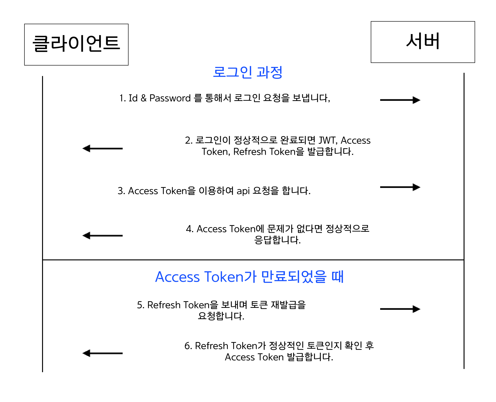

# 반영구적 로그인 관련 JWT, 세션 쿠키 조사

# **Session 기반 인증 방식**

- JWT 토큰 기반 인증 전까지 인증방식

## **인증 방식**

1. 클라이언트에서 로그인인 요청이 들어옴
2. 로그인에 성공하면 서버가 유저 세션을 만들고 메모리나 데이터베이스에 저장
3. 서버가 클라이언트에게 세션 ID를 보낸다.
4. 클라이언트의 브라우저에 세션의 ID만 쿠키에 저장하게 한다.
5. 세션 데이터가 서버의 메모리에 저장되므로, 확장 시 모든 서버가 접근할 수 있도록 별도의 중앙 세션 관리 시스템이 필요하다.

# **JWT 구성**


.을 구분자로 3가지 문자열로 구성 됨.

Header(헤더).Payload(내용).Signature(서명)

ex) xxxxxx.yyyyy.zzzzz

# 토큰의 만료 시간

토큰을 한번 발행하고 클라이언트 서버에 보내고 나면 이후에 서버에서는 토큰을 파괴시킬 방법이 존재하지 않는다. 보통 JWT 토큰은 클라이언트의 로컬 Storage에 저장하고 사용하게 되는데 이때 혹시나 토큰의 탈취 현상이 일어난다면 해당 토큰을 서버에서 제어할 수 없기 때문에 문제가 발생하게 된다.

- 만료시간을 짧게 함→보안에는 더 낫지만, 토큰이 만료될 때마다 사용자는 다시 로그인을 해줘야하거나 서버는 토큰을 매번 발행해야하는 번거로움이 발생
- 만료시간을 길게 함→ 사용의 편리함과 서버의 부하를 줄일 수 있지만, 보안에 취약해짐.

이를 적당히 보완하며 중간 지점을 맞추기 위해서 등장한 것이Access Token과 Refresh Token 이다.

# Access Token

- 리소스에 직접 접근할 수 있도록 해주는 정보만을 갖고 있습니다.
- Refresh Token에 비해서 짧은 만료 기간을 갖습니다.

# Rrefresh Token

- 새로운 Access Token을 발급받기 위한 정보를 가짐
- 클라이언트가 Access Token이 없거나 만료되면 Refresh Token을 통해 Server에 요청해서 새로운 Access Token을 발급 받을 수 있습니다.
- Access Token에 비해서 긴 만료 기간을 갖습니다.
- 외부에 노출되지 않도록 관리를 위해서 데이터베이스에 저장한다.

# JWT 인증 과정



JWT는 일반적으로 클라이언트와 서버, 서비스와 서비스 사이 통신 시 권한 인가(Authorization)를 위해 사용하는 토큰이며, api 요청의 header에 다음과 같이 넣어서 이용한다.

```
{
	"Authorization" : "Bearer jwt"
}
```

참고자료

1.JWT & 토큰 기반 인증 시스템
[https://velog.io/@yh20studio/토큰-기반-인증-시스템-JWT](https://velog.io/@yh20studio/%ED%86%A0%ED%81%B0-%EA%B8%B0%EB%B0%98-%EC%9D%B8%EC%A6%9D-%EC%8B%9C%EC%8A%A4%ED%85%9C-JWT)
(토큰 만료시간 무조건 있어야 하고, 보안 때문에 무제한 불가능.)

2.Vue - Login 세션 유지하기
[https://kdinner.tistory.com/60](https://kdinner.tistory.com/60)

3.[Vue] .txt 파일 저장하기 및 .txt 불러와 data에 바인딩하기
[https://dreamcoding.tistory.com/48](https://dreamcoding.tistory.com/48)

JavaScript에서 클라이언트 IP 주소 가져 오기 -보안 약할것 같다.
[https://www.delftstack.com/ko/howto/javascript/get-ip-address-javascript/](https://www.delftstack.com/ko/howto/javascript/get-ip-address-javascript/)

반영구적 로그인 관련 JWT, 세션 쿠키 조사